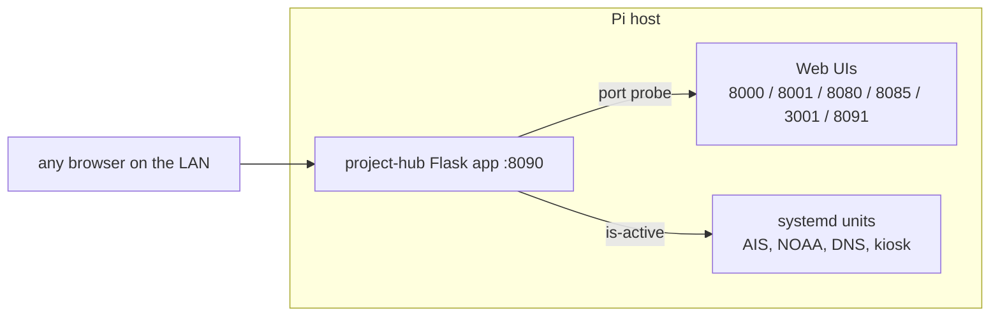
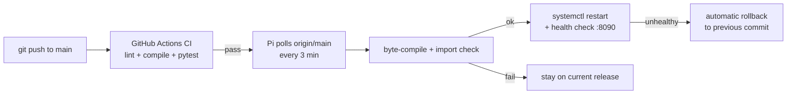

# Project Hub


A single-page operations portal for the services running on my Raspberry Pi
host `dunbot`. Every web UI and systemd unit on the box is reachable and
observable from one screen — the hub is the bookmark I actually use
dozens of times a day, and the page visiting relatives see when they open
the kiosk.

## What it does

- **Project cards** for everything on the host (dashboards, SDR tools,
  network services): live online/offline state per port, service health
  per systemd unit, and one-tap links
- **Status table** across all units with grouping by project
- **Host strip**: CPU temperature, uptime, disk usage
- Links resolve against whatever host/IP the visitor opened the hub with,
  so `dunbot.local`, the LAN IP and the Tailscale name all work

## Architecture



The app is intentionally dependency-light (Flask only). Service state is
read via `systemctl is-active`, and ports are probed with plain TCP
connects with a 1s timeout, so a hung service shows as offline rather
than hanging the page.

## CI/CD

CI runs on every push and pull request (GitHub Actions, Python 3.11 and
3.13): ruff fatal-rule lint, byte-compilation, and a pytest suite that
locks in the API shape and its offline behaviour.

Deployment is **pull-based**: the Pi polls `origin/main` every 3 minutes
(`deploy/deploy.sh` + systemd timer). New code is byte-compiled and
import-checked *before* the service restarts; if the app then fails its
health check on :8090, the previous commit is automatically redeployed.
Commits made directly on the Pi restart the service through the same
gate — the deploy marker (`.deployed_commit`) tracks what is actually
running. Unpushed local work is never overwritten, and a commit that
failed its health check is never retried until a newer commit lands.



Only `origin/main` is ever deployed, so pull requests from forks can
never execute code on the host.

## Local development

```bash
python3 -m venv venv
venv/bin/pip install -r requirements.txt
venv/bin/python app.py          # hub on :8090
venv/bin/pip install pytest && venv/bin/pytest -v
```

With none of the tracked services running, the hub still renders and
simply shows everything as offline — that behaviour is covered by the
test suite.
